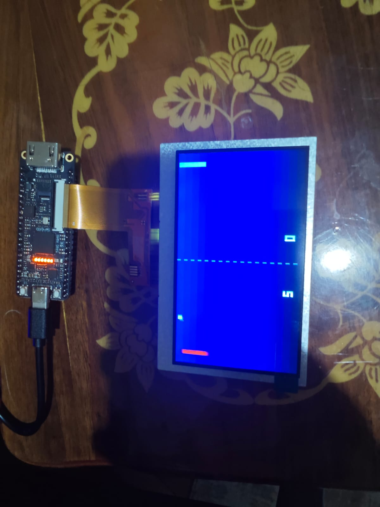
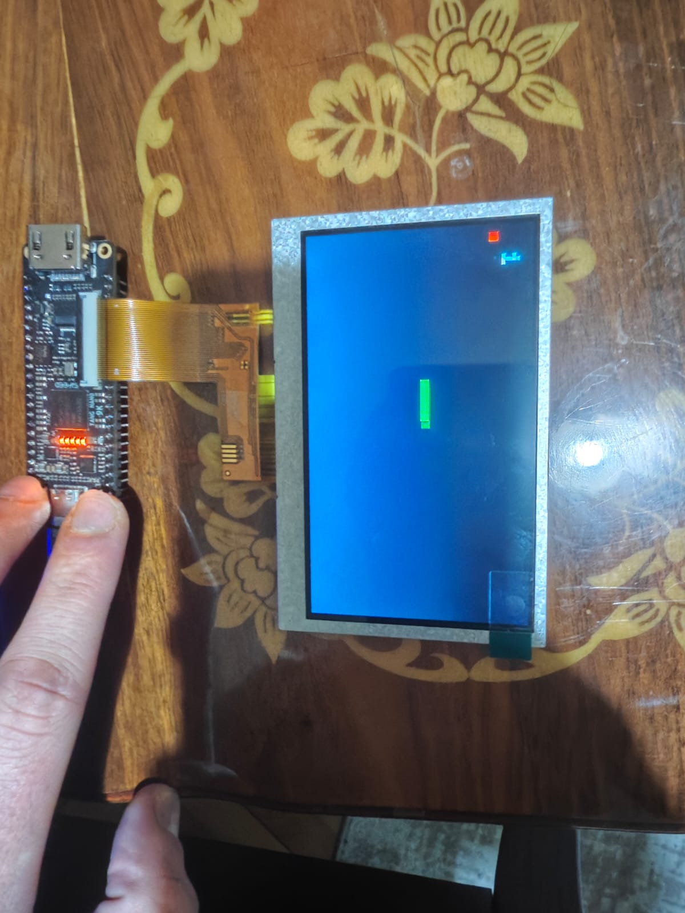
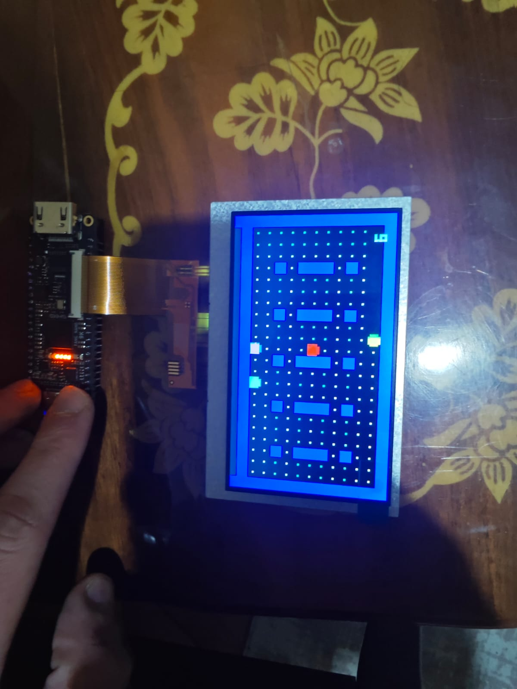

# 🎮 FPGA Retro Game Console (Tang Nano 9K)

A multi-game retro console project designed **entirely in Verilog** on the **Sipeed Tang Nano 9K** FPGA development board.

This project demonstrates how **game logic, physics engines, and graphics generation** can be implemented directly with **logic gates (RTL)**, **without using** any processor (CPU), microcontroller, or ready-made software libraries.

  
  
  

---

## 📖 Project Overview

This project transforms a standard FPGA board into a fully functional **game console driving a 4.3-inch LCD display**.  
The core philosophy is **“Zero Software”**: every pixel drawn on the screen, every collision detection, and every AI decision is synthesized **purely at the hardware level (RTL)**.

The console includes **4 classic arcade games**, selectable through an on-screen menu system.

---

## 📷 Game Screenshots

| 🏓 Pong                                                 | 🐍 Snake                                                  |
| ------------------------------------------------------- | --------------------------------------------------------- |
|  |  |
| **AI Opponent & Two-Player Mode**                       | **Accelerating Gameplay & Tail Management**               |

|🐦 Flappy Bird|👻 Pac-Man|
|---|---|
|||
|**Physics Engine & Jump Queue**|**3 Intelligent Ghosts & Procedural Maze**|

---

## 📂 File Structure

You can directly access the project files via the links below:

<pre>
src/
├── <a href="src/TOP.v"><em>TOP.v</em></a>              # Ana Modül (Oyun Seçici & Sinyal Yönlendirme)
├── <a href="src/VGAMod.v"><em>VGAMod.v</em></a>           # VGA Sürücüsü & Görüntü Oluşturma
├── <a href="src/pong_logic.v"><em>pong_logic.v</em></a>       # Oyun Mantığı: Pong
├── <a href="src/snake_logic.v"><em>snake_logic.v</em></a>      # Oyun Mantığı: Snake
├── <a href="src/flappy_logic.v"><em>flappy_logic.v</em></a>     # Oyun Mantığı: Flappy Bird
├── <a href="src/pacman_logic.v"><em>pacman_logic.v</em></a>     # Oyun Mantığı: Pac-Man
├── <a href="src/Debounce.v"><em>Debounce.v</em></a>         # Buton Parazit Engelleyici
└── <a href="src/gowin_rpll/gowin_rpll.v"><em>gowin_rpll.v</em></a>       # PLL IP Core (27MHz -> 9MHz)
</pre>

---

## 🏗️ Hardware Architecture

The design follows a **modular architecture**, separating **Game Logic** and **Graphics Rendering**.


```mermaid
graph TD
    CLK[27MHz Kristal] --> PLL[rPLL IP Core]
    PLL -->|9 MHz Piksel Saati| TOP
    
    BTN[Fiziksel Butonlar] --> DEB[Debounce Modülü]
    DEB --> TOP[TOP Modül / Oyun Seçici]
    
    TOP --> PONG[Pong Logic]
    TOP --> SNAKE[Snake Logic]
    TOP --> FLAPPY[Flappy Bird Logic]
    TOP --> PACMAN[Pac-Man Logic]
    
    PONG --> MUX[Sinyal Birleştirici]
    SNAKE --> MUX
    FLAPPY --> MUX
    PACMAN --> MUX
    
    MUX --> VGA[VGA Renderer Mod]
    VGA --> LCD[4.3 inç LCD Ekran]
````

---

## 🔍 Source Code Analysis

Technical details explaining the purpose of each Verilog module:

### 1. System & Control Modules

- **<a href="src/TOP.v"><em>TOP.v</em></a> (Top Module)**
    
    - **Purpose:** The brain of the system. Interconnects all submodules.
        
    - **Function:** Contains the _Game Selector_ finite state machine.  
        Pressing both buttons simultaneously for **2 seconds** changes the `game_mode` register, switching between games.
        
- **<a href="src/Debounce.v"><em>Debounce.v</em></a>**
    
    - **Purpose:** Signal conditioning.
        
    - **Function:** Filters mechanical button bouncing noise.  
        Ensures the signal remains stable for ~30 ms, preventing false double presses during gameplay.
        
- **<a href="src/gowin_rpll/gowin_rpll.v"><em>gowin_rpll.v</em></a>**
    
    - **Purpose:** Clock frequency management.
        
    - **Function:** Converts the onboard **27 MHz crystal oscillator** to **9 MHz**, suitable for the 4.3-inch LCD timing.
        

---

### 2. Graphics Engine

- **<a href="src/VGAMod.v"><em>VGAMod.v</em></a>**
    
    - **Purpose:** Procedural renderer.
        
    - **Function:** Instead of reading pixels from RAM, it **computes pixel colors in real time** based on the current scan coordinates (`draw_x`, `draw_y`).
        
    - **Layering:** Uses a priority system to determine which object appears on top (e.g., _Text > Player > Background_).
        
    - **Font Rendering:** Includes a bitmap font table for drawing numbers and “GAME OVER” text.
        

---

### 3. Game Logic Modules

- **<a href="src/pong_logic.v"><em>pong_logic.v</em></a>**
    
    - Uses simple **AABB (Axis-Aligned Bounding Box)** collision detection.
        
    - **AI:** The opponent paddle continuously tracks the ball’s Y-coordinate.
        
- **<a href="src/snake_logic.v"><em>snake_logic.v</em></a>**
    
    - **Memory:** Uses register arrays (`reg [5:0] body_x [0:63]`) to store the snake’s body positions.
        
    - **RNG:** Apple positions are generated using a **Linear Feedback Shift Register (LFSR)**.
        
- **<a href="src/flappy_logic.v"><em>flappy_logic.v</em></a>**
    
    - **Physics:** Uses signed arithmetic for velocity and gravity calculations (`velocity <= velocity + gravity`).
        
    - **Input Buffering:** Implements a **Jump Queue** to synchronize button presses with the physics engine, ensuring no input is missed.
        
- **<a href="src/pacman_logic.v"><em>pacman_logic.v</em></a>**
    
    - **Map:** Maze walls are defined mathematically via a coordinate function (`check_wall`), not stored as images.
        
    - **AI:**
        
        - _Red Ghost:_ Calculates a vector toward the player and attempts shortest-path targeting.
            
        - _Other Ghosts:_ Move in semi-random patterns.
            

---

## 🛠️ Hardware Setup

- **FPGA Board:** Sipeed Tang Nano 9K (Gowin GW1NR-9C)
    
- **Display:** 4.3-inch RGB Interface LCD (40-pin)
    
- **Connection:** LCD connects directly to the onboard FPC connector
    

---

## 🎮 Controls

The console is controlled using **only two buttons** (S1 and S2).

|Action|S1 Button (Left)|S2 Button (Right)|
|---|---|---|
|Game Switch|**S1 + S2 (Hold 2 seconds)**|**S1 + S2 (Hold 2 seconds)**|
|Pong|Move Paddle Down|Move Paddle Up|
|Snake|Turn Left|Turn Right|
|Flappy Bird|Jump|Jump|
|Pac-Man|Turn Left|Turn Right|

---

## 🚀 How to Program

1. Download and install **Gowin EDA**.
    
2. Open the project files.
    
3. From the **Process** tab, run **Synthesize**, then **Place & Route**.
    
4. Open **Gowin Programmer**.
    
5. Select **Embedded Flash Mode** to retain the game after power loss.
    
6. Click **Program/Configure** to upload the bitstream.
    

---

**Developer:** Salih Tekin Ayvacı

